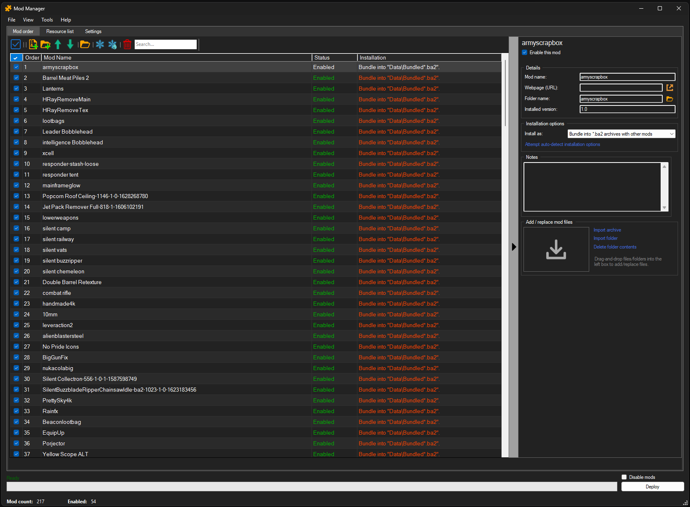

# Fallout 76 Quick Configuration

### Tired of searching through the web for *.ini tweaks, and installing mods single-handedly?

This tool allows you to change various game settings and install mods.

## ✨ Features

### *.ini tweaks
- Change display, graphics, volume, audio, interface, and voice chat settings.
- Disable VSync (frame rate cap).
- Change your FOV.
- Mouse sensitivity fix for ALL aspect ratios.

### Pip-Boy customization
- Change the color and resolution of your Pip-Boy and Quick-Boy.
- Use color presets from previous Fallout games.
- See a preview of how the color will look in the game.

### Mod manager
- Install and manage mods.

### Gallery
- Access all your screenshots and photos from the gallery.

## 💡 Requirements
- This program runs on .NET Framework 4.7.2 (typically preinstalled on Windows 10/11).
- Archive2 requires Visual C++ Redistributable for Visual Studio 2012 Update 4.

## ⚙️ Installation & Usage
1. Download and unzip the release.
2. Run the tool and configure your game path/edition.
3. Apply your preferred tweaks.
4. Press the **Apply** button to write the settings to your *.ini files.

## 📌 License
© MIT
